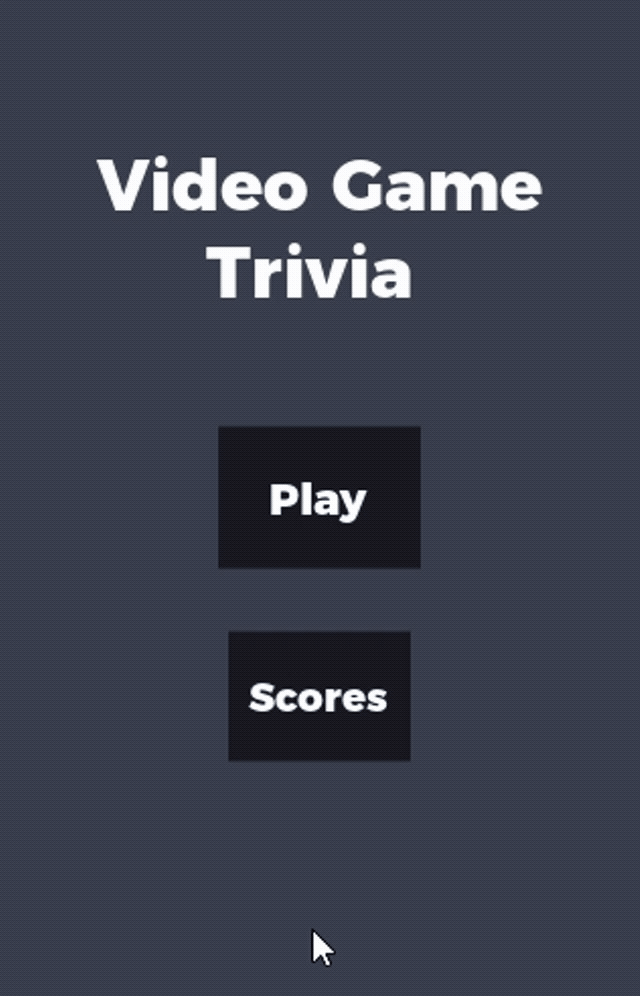
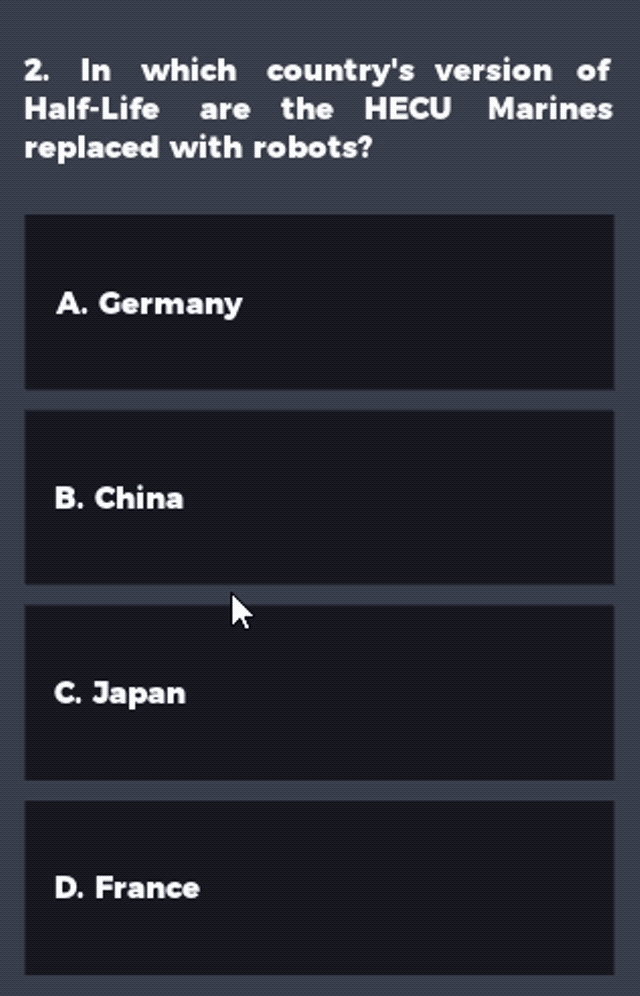

# Video_Game_Trivia

## Description
A trivia game that tests you knowledge on video games. A user is given a number of questions, and the user must answer each question correctly to avoid a game over. This app is built using Kivy, a python framework for cross-platform application development, and the questions were grabbed from the Open Trivia Database.

## Demo

